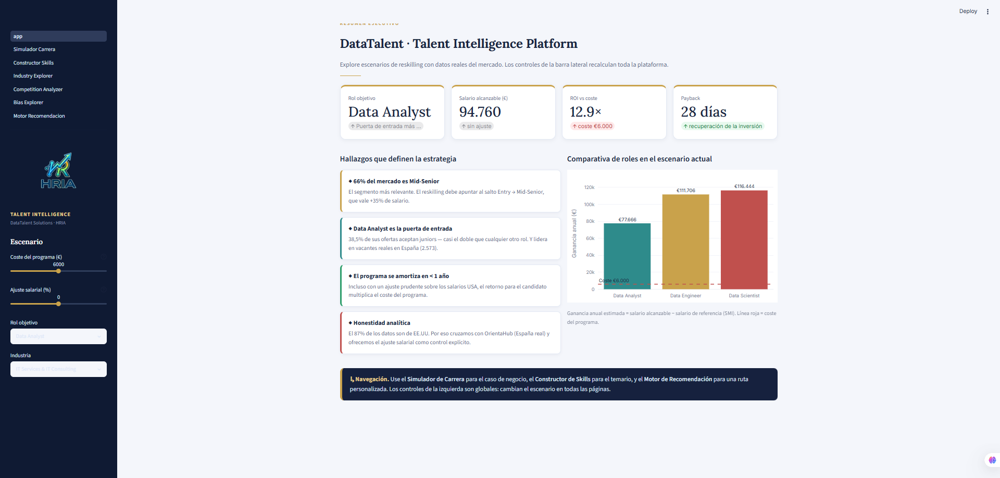
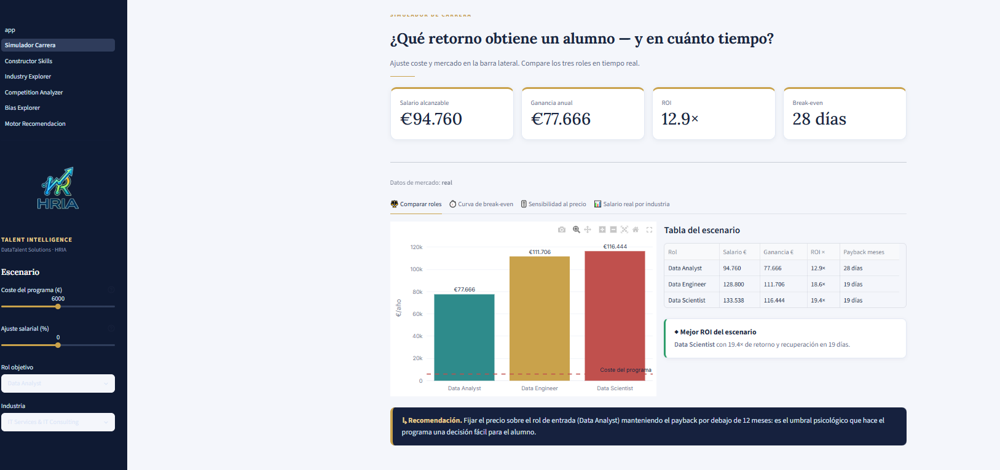
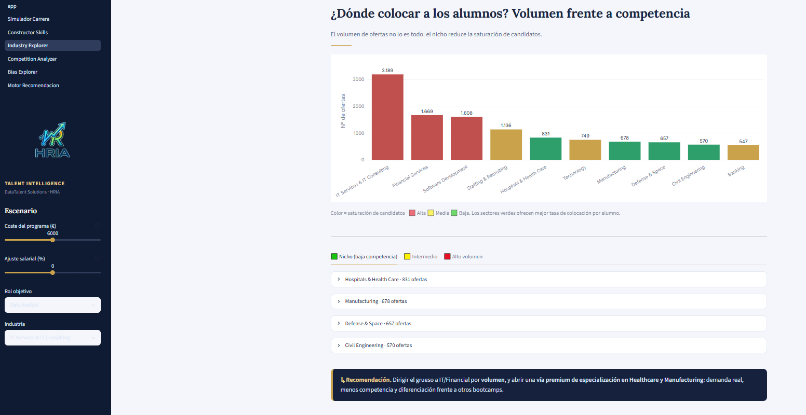
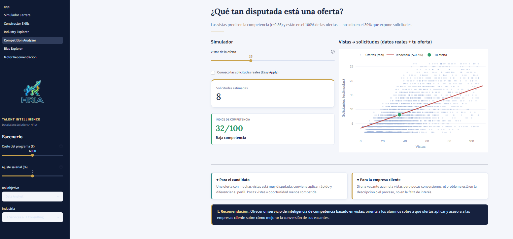
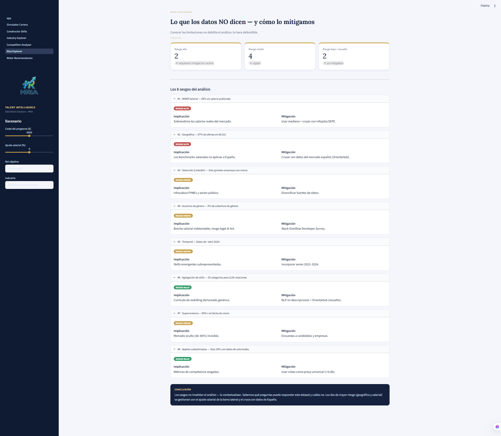
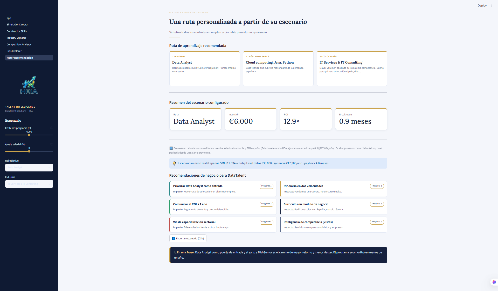

# HRIA · Talent Intelligence Platform

A data-driven workforce intelligence platform developed for DataTalent Solutions to transform labor market data into actionable reskilling strategies.

HRIA enables organizations to evaluate career pathways, design market-aligned training programs, identify placement opportunities, assess competition levels, and generate evidence-based recommendations for workforce development.

Play our interactive dashboard --> https://hria-dts.streamlit.app/


## 📑 Table of Contents

- [🎥 Demo Video](#-demo-video)
- [🚀 Key Features](#-key-features)
- [📸 Platform Walkthrough](#-platform-walkthrough)
- [🔧 Technical Details](#-technical-details)
- [👥 Contributors](#-contributors)
- [📜 Attribution](#-attribution)
- [📄 License](#-license)

---

## 🎥 Demo Video

<a href="https://www.youtube.com/watch?v=570OBE56TkA" target="_blank">
  
</a>

---

## 🚀 Key Features

- 📊 Workforce Intelligence Dashboard
- 💰 ROI & Payback Simulation
- 🎯 Career Path Analysis
- 🛠 Skills-Based Curriculum Builder
- 🏭 Industry Opportunity Explorer
- 📈 Competition Analysis
- ⚖️ Bias & Data Quality Assessment
- 🧠 Recommendation Engine
- 🔄 Real-time Scenario Modeling

---

## 📑 Table of Contents

- [Platform Walkthrough](#-platform-walkthrough)
- [Technical Details](#-technical-details)
- [Contributors](#-contributors)
- [Attribution](#-attribution)
- [License](#-license)

---

# 📸 Platform Walkthrough

## Figure 1 — Executive Dashboard



*Figure 1. Executive overview of the platform displaying target role selection, salary projections, ROI calculations, payback period, and strategic labor market insights.*

---

## Figure 2 — Career Simulator



*Figure 2. Interactive simulator used to estimate salary outcomes, ROI, and break-even periods for different reskilling pathways.*

---

## Figure 3 — Skills Builder (Empty State)


*Figure 3. Initial state of the curriculum builder before selecting competencies.*

---

## Figure 4 — Skills Builder (Configured)


*Figure 4. Curriculum configured using real labor market demand data and coverage analysis.*

---

## Figure 5 — Industry Explorer



*Figure 5. Industry analysis highlighting placement opportunities and candidate saturation levels.*

---

## Figure 6 — Competition Analyzer



*Figure 6. Competition model based on job visibility and estimated application volumes.*

---

## Figure 7 — Bias Explorer



*Figure 7. Transparency framework documenting dataset limitations, analytical risks and mitigation strategies.*

---

## Figure 8 — Recommendation Engine



*Figure 8. Personalized recommendation engine generating actionable reskilling strategies from labor market intelligence.*

---

# 🔧 Technical Details

<details>
<summary>⚙️ Installation</summary>

```bash
pip install -r requirements.txt
streamlit run app.py

## 🔧 Technical Details

<details>
<summary>⚙️ Installation</summary>

```bash
pip install -r requirements.txt
streamlit run app.py
```

</details>

<details>
<summary>🏗 Project Structure</summary>

```text
app.py                               # Executive Dashboard

pages/
├── 1_Simulador_Carrera.py           # ROI, payback and pricing simulator
├── 2_Constructor_Skills.py          # Curriculum builder and demand coverage
├── 3_Industry_Explorer.py           # Industry opportunity analysis
├── 4_Competition_Analyzer.py        # Competition estimation model
├── 5_Bias_Explorer.py               # Bias assessment framework
└── 6_Motor_Recomendacion.py         # Personalized recommendation engine

lib.py                               # Business logic and design system
data/                                # Market datasets
assets/                              # Branding and visual assets
docs/images/                         # Documentation screenshots
```

</details>

<details>
<summary>🔄 Global Scenario Controls</summary>

The sidebar controls update every page simultaneously through Streamlit Session State:

* Program Cost (€2,000–€10,000)
* Salary Adjustment (−20% to +20%)
* Target Role
* Industry

Changes instantly recalculate KPIs, charts, recommendations and ROI metrics across the platform.

</details>

<details>
<summary>🧩 Streamlit Components</summary>

* Session State
* Sidebar Controls
* Metrics
* Tabs
* Expanders
* Dynamic Columns
* Plotly Visualizations
* Data Caching
* Download Buttons
* Cross-page State Management

</details>

<details>
<summary>📊 Data Sources</summary>

Sources used throughout the analysis:

* LinkedIn Jobs 2024
* OrientaHub
* Fundación Telefónica
* Spanish Labor Market Data (Dec 2025 – Apr 2026)

The salary adjustment control compensates for the predominance of U.S.-based salary observations.

The Bias Explorer documents all identified limitations and assumptions.

</details>

<details>
<summary>🔴 Live Data Layer (Phase 2)</summary>

`data_loader.py` calculates live market metrics using:

1. Uploaded CSV via sidebar.
2. Local dataset (`data/data_roles_completo.csv`).
3. Synthetic calibrated dataset (~5,200 offers).

Features powered by the live layer:

* Real salary by industry
* Competition Analyzer
* Correlation calculations
* Dynamic salary benchmarks
* Market-driven recommendations

Expected schema:

```text
salary_annual
views
applies
formatted_experience_level
formatted_work_type
job_industries_list
job_skills_list
comp_country
data_role
```

The loader automatically detects aliases and infers missing role labels when necessary.

</details>

---

 Repository Architecture

The platform is intentionally split across two repositories:

| Repository | Purpose |
|---|---|
| MajoRodri/HRIA | EDA notebooks, datasets, and analytical pipeline |
| adryeli/hria_streamlit | Streamlit deployment — live application only |

Why two repos?
The production deployment (hria_streamlit) is isolated from the research data and notebooks.
This means the live URL has no direct access to raw datasets, analytical code, or sensitive
market data — reducing exposure in case of unauthorized access attempts.

---

## 👥 Contributors

| Member                                                | Role                      |
| ----------------------------------------------------- | ------------------------- |
| [MajoRodri](https://github.com/MajoRodri)             | Data Analyst & Developer  |
| [MariaIsaDurango](https://github.com/MariaIsaDurango) | Data Analyst & Developer  |
| [SiR0N](https://github.com/SiR0N)                     | Data Analyst & Developer  |
| [JCRbit](https://github.com/JCRbit)                   | Scrum Master & Developer  |
| [adryeli](https://github.com/adryeli)                 | Product Owner & Developer |

---

## 📜 Attribution

If you use, adapt, redistribute, or build upon HRIA, please include:

> Based on HRIA (HR Intelligence & Bias Analysis), originally developed by the HRIA Team.

Original repositories:

* https://github.com/MajoRodri/HRIA
* https://github.com/adryeli/hria_streamlit

---

## 🔧 Tech Stack

<details>
<summary>⚙️ Technologies used</summary>

<br>

```text
Language     Python 3.11
Framework    Streamlit
Viz          Plotly · Matplotlib · Seaborn
Data         Pandas · NumPy · SciPy
Styling      Custom CSS · Streamlit Theme
State        Streamlit Session State
Data I/O     CSV · Synthetic dataset fallback
CI           GitHub Actions (planned)
```

</details>

---

## 📄 License

See the LICENSE file for details.
